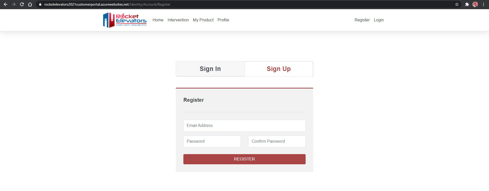
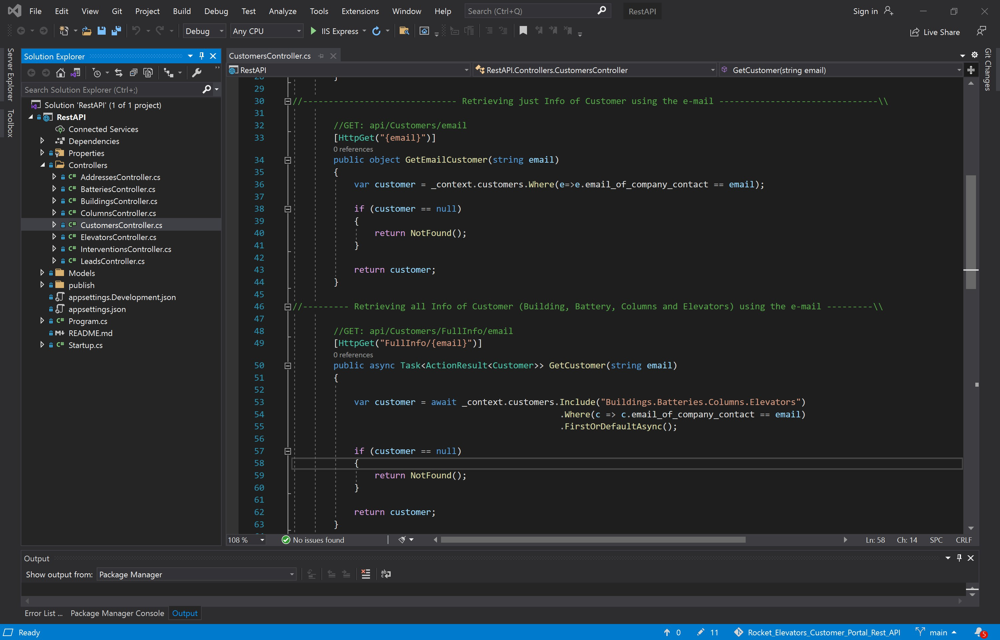
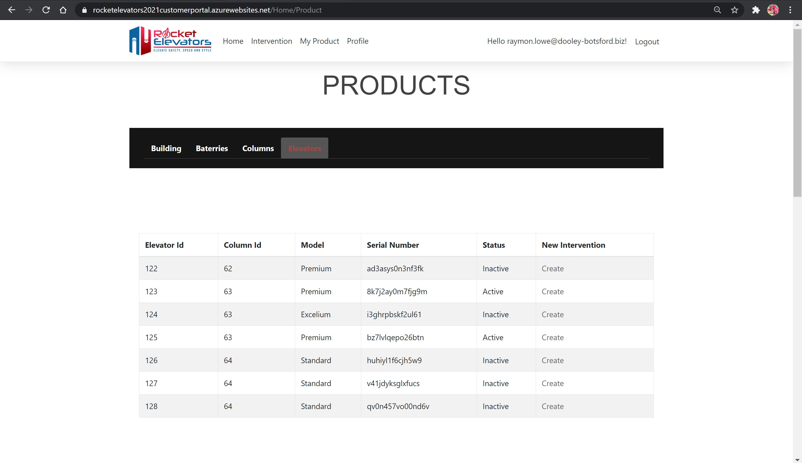
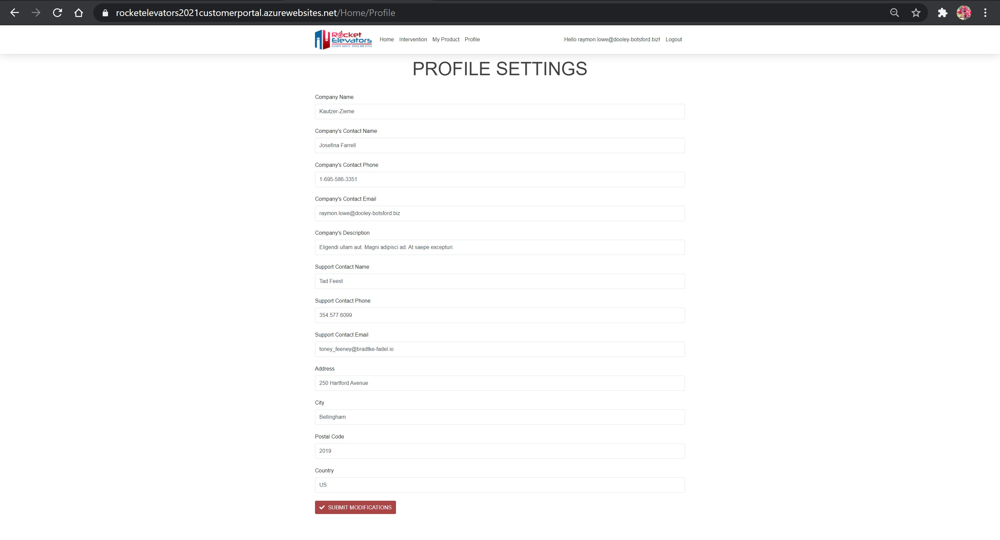

# Rocket Elevators Customer Portal 
-----------------------------------------------------------------------------------------------

## CodeBoxx Odissey - Week 11 - .NET Core

-----------------------------------------------------------------------------------------------
### Project by:
Cristiane Santiago

[URL for Customer Portal:  https://rocketelevatorsrestapi2.azurewebsites.net/](https://rocketelevatorsrestapi2.azurewebsites.net)

[URL for Rest API:  https://rocket-elevators.azurewebsites.net](https://rocket-elevators.azurewebsites.net)

[Click here to see the presentation video](	https://www.youtube.com/watch?v=npTVRcXBt2s)

-----------------------------------------------------------------------------------------------

# [(This is the repository for the items 1, 2, 4 and 5, mentioned in this Readme file. To access the repository, for the Rocket Elevators Rest API, that has the item 3, mention in this Readme, please click in this link)](https://github.com/cris-s-santiago/Rocket_Elevators_Customer_Portal_Rest_API)

-----------------------------------------------------------------------------------------------

This week deliverables:

## 1) Create a new portal, specially for Rocket Elevators's customers;

    login: kathline.weissnat@howe.io  /  password: 123456

### Sign Up and Sign In page

### Home page, once signed in

## 2) Create a new SQL database, specially for this portal, that should contain only the login and password informations about the client;
   

## 3 new Rest API end points:

## 3.A) GET: to verify if the email from login page already exists in the MySQL database. If it exists, so the client will have access to this portal;

## 3.B) GET: to retrieve informations from the client that are in the main Rocket Elevators's database (MySQL), like his/her buildings, batteries, columns, elevators;

## 3.C) PULL: for all customer's informations

## 4) A page for Intervention, in this new portal, where the client will be able to create his/her own interventions;

## 5) A page for the client's products, in this new portal, where the client will be able to consult the informations about his/her products and also it will be possible to create an interventions from this page, that will lead the selected and sent informations, to the page Intervention and then it will be possible to create a description and submit the form; 

## 6) A page for the customer's profile informations, in this new portal, where the user can update any information;

-----------------------------------------------------------------------------------------------

# Rocket Elevators Customer Portal
-----------------------------------------------------------------------------------------------